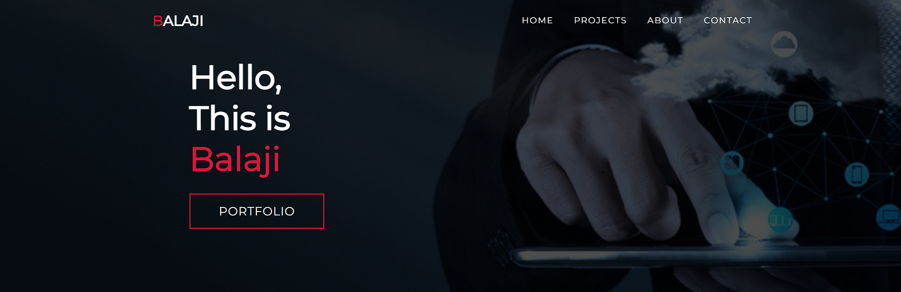

# Portfolio
My portfolio website :    
It includes the projects that I've completed and the projects that I am currently working on    
It has a short section  ```ABOUT ME```  that discuss the things that I've learnt  and my educational qualification   

---

<p align="center">

</p>

---

## Features
- Responsive
- Simple UI

---

## Contributors

- Balaji

---

## License & Copyright

Copyright [©balaji](https://github.com/balajirai)

Licensed under the [MIT License](LICENSE)
